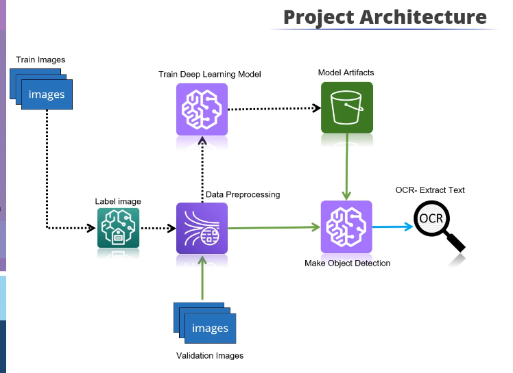
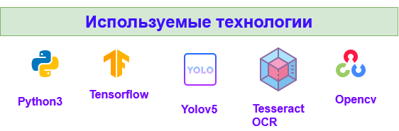
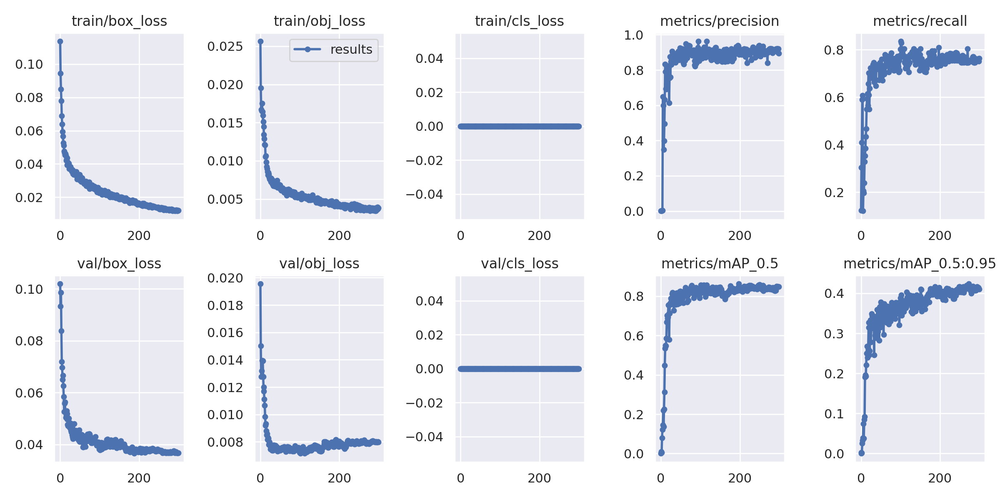
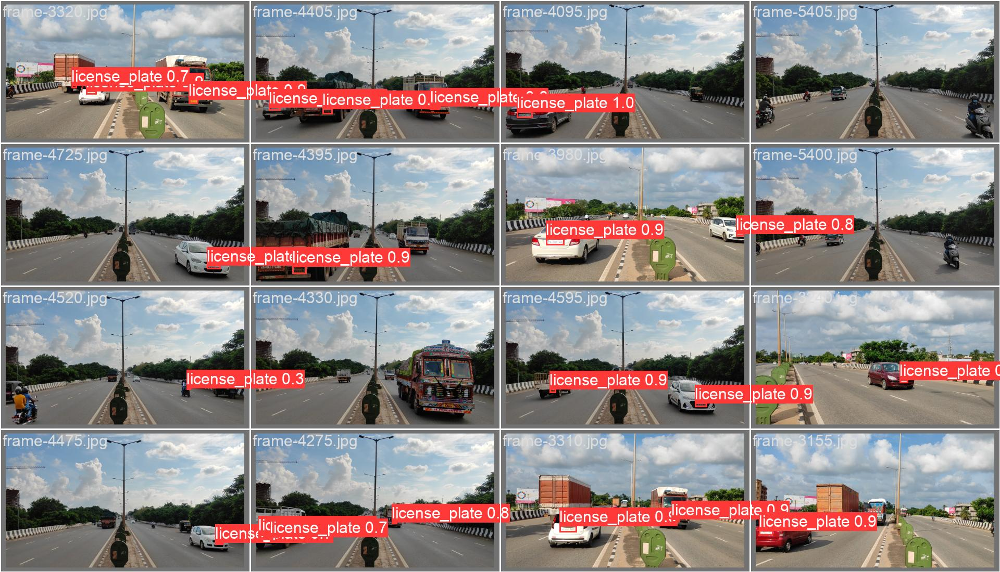
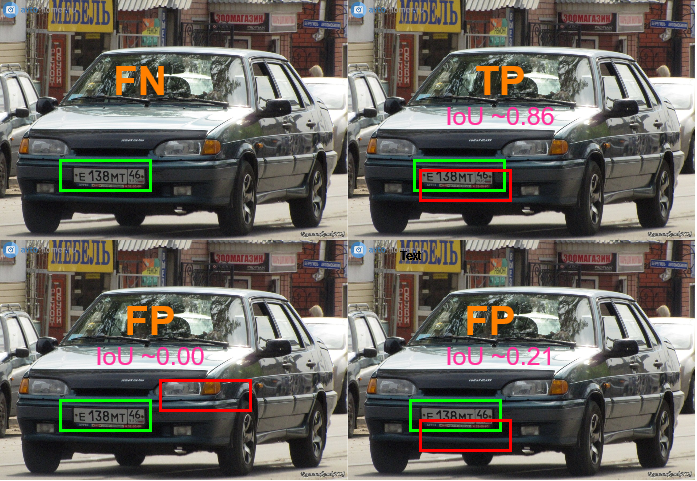
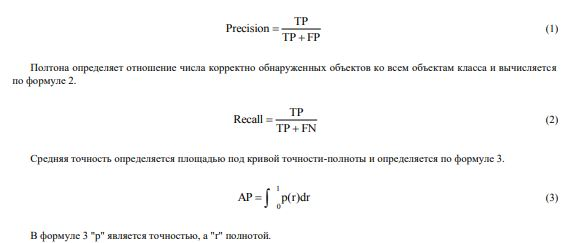
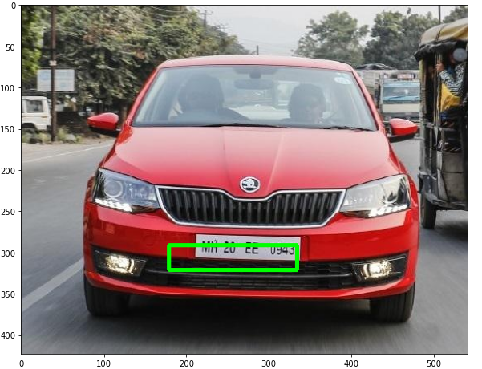
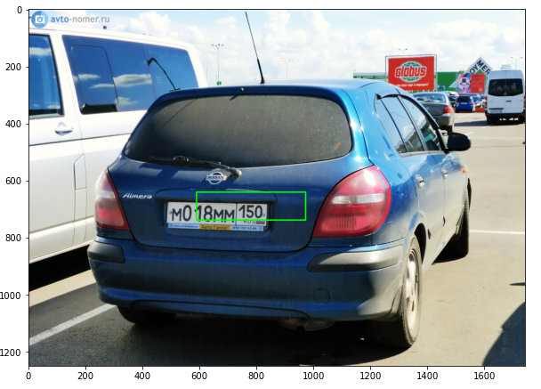
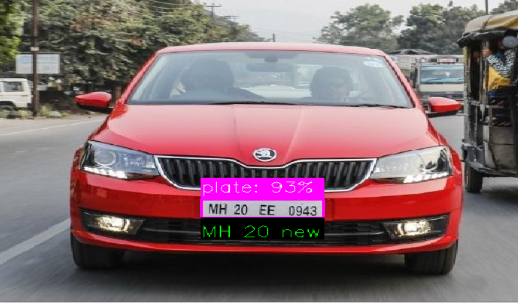
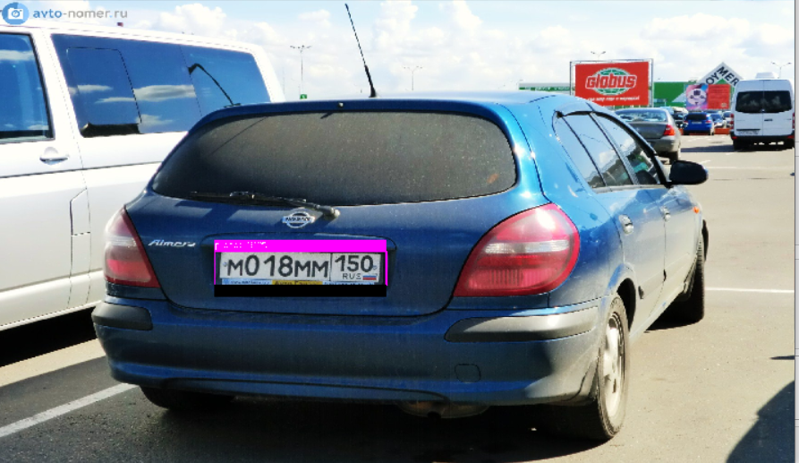

# Система распознавания автомобильных номеров

## Disclaimer

Это первая попытка переноса кода обучения модели в формат скрипта, поэтому при возникновении ошибок, пожалуйста, воспользуйтесь нашим [colab-ноутбуком](https://colab.research.google.com/drive/1lIPxpevRpa20-TL_uK4XlQGeaDVv1Rfl)!

## Overview

Данный репозиторий содержит код обучения и разработки сервиса для распознавания автомобильных номеров на КПП.

### О системе
Пропускная система, помогающая охраннику идентифицировать автомобиль с целью принятия решения по допуску через КПП предприятия на территорию.

  

<p align="middle">
  
</p>

Принцип работы:

0. Камера, установленная на КПП, фиксирует номера подъезжающих автомобилей;
1. Осуществляется поиск распознанных номеров в базе данных, в которой хранятся данные об автомобилях, у которых есть допуск на территорию;
2. После идентификации автомобиля по номеру система выдает охраннику для принятия решения следующую информацию из БД: информацию о водителе, об организации, которой принадлежит ТС и пр.;
3. На основании полученных данных охранник принимает решение о пропуске машины на территорию.

Замечания:
1. База данных пополняется сторонним сервисом, мы считаем, что все допущенные на территорию ТС уже занесены в БД;
2. В первом приближении считаем, что автомобили имеют формат номера x000xx00(0), так как это упрощает процес обработки распознанных номеров;
3. Сервис работает с изображениями, а не с видео, так как от системы не требуется мнговенного отклика, камера будет опрашиваться периодически.


## Dataset

Для обучения модели на детектирование номеров был использован датасет [VKCV_2022_Contest_02: Carplates Recognition](https://www.kaggle.com/competitions/vkcv2022-contest-02-carplates/data).
Данный датасет содержит 28790 изображений, для обучения модели была использована случайная выборка данных в размере:
* train - 1001 изображений
* val - 100 изображений
* test - 50 изображений

Изображения хранятся в форматах .jpg, .jpeg, .png, .bmp. В датасете изображения разных размеров, поскольку приводятся к единому размеру в процессе обучения.

## Project structure

Проект имеет следующую структуру:
* yolov5 - склонированный [репозиторий](https://github.com/ultralytics/yolov5)
* model - папка со скриптами
  * runs/detect - папка, с данными о просмотренных номерах, создается автоматически
  * utils - папка со служебными скриптами
	* data.py - переразметка изображений в формат YOLO
	* predictor.py - функции, необходимые для получения предсказаний
	* printer.py - функции, необходимые для вывода результата в виде изображения
	* test.py - подсчет CER
	* translator.py - функции для перевода схожих символов русского и английского алфавитов 
  * trainer.py - скрипт обучения
  * pipeline.py - скрипт для детектирования номера
* dataset - папка с датасетом
  * train
  * val
  * test
  * train.json - изначальный формат разметки изображений
* dataset.yml - конфигурационный файл с информацией о датасете
* last.pt - веса дообученной модели

Папку с датасетом можно взять [здесь](https://drive.google.com/drive/folders/1tR_B7m3L5tiuntv--fGtWnMrni05VJIf?usp=sharing), файл last.pt доступен по [ссылке](https://drive.google.com/file/d/1o5w-KSCqSMMMNmjdL5bwMa5TG7QqnxJp/view?usp=sharing).

## Logging

Локально результаты обучения сохраняются в папку `/runs/train/exp`, которая создается при запуске обучения.

## Training

Для детектирования номеров была использована предобученная модель архитектуры `YOLOv5`, дообученная на датасете, описанном выше.
Для распознавания текста использовался фреймворк `EasyOCR`.

Для запуска обучения модели следует запустить скрипт `python trainer.py`

## Результаты

<p align="middle">
  
  
</p>

Для проверки работы системы запустите скрипт 
```
cd model
python pipeline.py ссылка_на_изображение
```
Например: `python pipeline.py https://777nomera.ru/images/os_imagegallery_99/original/8043169.jpg` или `python pipeline.py https://777nomera.ru/images/avtogallery/BOP/ru5497672.jpg` для машин из базы данных или `python pipeline.py https://777nomera.ru/images/avtogallery/BOP/ru5497672.jpg`, чтобы увидеть, что проезд запрещен.

<p align="middle">
  
  
  
</p>

В качестве метрики была выбрана метрика Character Error Rate (CER). Подробнее о ней можно прочитать [здесь](https://towardsdatascience.com/evaluating-ocr-output-quality-with-character-error-rate-cer-and-word-error-rate-wer-853175297510).
Mean CER системы = 44.40%.
Запустить скрипт тестирования можно следующим образом:
```
cd model/utils
python test.py
```

## Эксперименты

#### Конфигурация экспериментального стенда

Обучение и валидация моделей производилась на платформе GoogleColab и VK Cloud ML Platform. Для обучения и валидации моделей используются YOLOv5 и RESNET соответственно. Для улучшения результатов обучения были выбраны уже предобученные модели. Библиотекой yolov5 предоставляются 5 различных предобученных на наборе данных COCO моделей, которые отличаются размером, скоростью выполнения и точностью. Была выбрана YOLOv5s, так как она по сравнению с YOLOv5m имеет намного большую точность и не теряет скорости, а по сравнению с YOLOv5l имеет немного меньше точности, но теряя при этом в скорости.

Гиперпараметры обучения моделей:
|Модель   |Количество эпох (epochs)   |Размер пакета (batch size)   |Image size   |
|---|---|---|---|
|Yolov5s   |300   |8   |640   |
|RESNET   |200   |10   |640   |

#### Критерии оценки 

Для сравнения результатов двух разных моделей глубокого обучения для обнаружения автомобильного номера был применен ряд стандартных метрик, используемых для оценки моделей машинного обучения. Есть всего 4 возможных исхода при выделении ограничивающих рамок и обнаружении объекта: истинно положительные (англ. TP), истинно отрицательные (англ. TN), ложно положительные (англ. FP) и ложно отрицательные (англ. FN). TP результат означает, что модель корректно определила положительный класс. TN результат означает, что модель корректно определила отрицательный класс. FP результат означает, что модель некорректно определила положительный класс. FN результат означает, что модель некорректно определила отрицательный класс. В данной задаче одноклассового обнаружения положительным классом является автомобильный номер, а отрицательным задний фон. Таким образом, TP – верное обнаружение автомобильного номера, TN – верное обнаружение фона (данный показатель не используется, так как область заднего фона не выделяется при аннотировании), FP – некорректное обнаружение автомобильного номера, FN – отсутствие обнаружения. Графическое объяснение представлено далее (см. рисунок).

<p align="middle">
  
</p>
<p align="middle"> Рис. – Визуальная демонстрация определений TP, FP, FN </p>

Для определения принадлежности результата к одной из четырех групп используется метрика IoU, которая является отношением области пересечения к области объединения корректной и предсказанной ограничивающих рамок.

На основе полученных результатов TP, FP и FN подсчитываются стандартные показатели: точность (англ. precision), полнота (англ. recall) и средняя точность (англ. AP). Также рассчитывается отдельно количество кадров, которое способна обработать модель за одну секунду (англ. FPS).

Точность определяет отношение числа корректно обнаруженных объектов ко всему количеству обнаруженных объектов и вычисляется по формуле ниже 1.

<p align="middle">
  
</p>

Кривая точности-полноты показывает зависимость изменения точности при изменении полноты для разных пороговых значений. В данном исследовании графики кривых точности-полноты построены на основе широко используемого порогового значения IoU равного 0.6.

Средняя точность является одной из наиболее используемых метрик для определения качества модели обнаружения объектов. При этом средняя точность может включать в себя различные метрики в зависимости от IoU. Наиболее используемыми является значение AP при IoU не меньше 0.5.

Количество кадров в секунду — это основной показатель быстроты модели. В основном считается, что показатель FPS выше 30 достаточен для выполнения обнаружения в потоковом режиме.

#### Сравнение результатов моделей

Размер обученных моделей YOLOv5 и RESNET составил 27.2 МБ и 430 МБ соответственно. После обучения модели были протестированы на валидационном наборе. Результаты представлены далее.

Результаты валидации моделей на наборе данных:
|Архитектура   | P  | R  | mAP50  | FPS, к/с  |
|---|---|---|---|---|
| Yolov5s  | 0.917  | 0.754  | 0.847  | 0.424  |
| RESNET   | 0.712  | 0.492  | 0.562  | 0.476  |

RESNET Neural Network:

<p align="middle">
  
  
</p>

Yolo:
<p align="middle">
  
  
</p>

YOLOv5 удовлетворяет требованиям обнаружения, при этом сохраняет достаточно высокую точность. Однако при получении изображений с другой средой может потерять точность обнаружения как при пороговом значении IoU равном 0.5, так и при больших.

#### Заключение

В результате исследования был готовый набор данных. Главные представители двух групп алгоритмов обнаружения объектов YOLOv5 и RESNET были обучены с использованием подготовленного набора данных. Экспериментальным образом были получены метрики моделей. Результаты показали, что модель YOLOv5 сохраняет высокую точность при различных входных данных, и имеет лучшую скорость обработки. Её должно быть достаточно для решения задачи обнаружения номера автомобиля, погрешность подсчета с такой точностью считается допустимой. 
