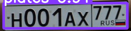

# Система распознавания автомобильных номеров

## Disclaimer

Это первая попытка переноса кода обучения модели в формат скрипта, поэтому при возникновении ошибок, пожалуйста, воспользуйтесь нашим [colab-ноутбуком](https://colab.research.google.com/drive/1lIPxpevRpa20-TL_uK4XlQGeaDVv1Rfl)!

## Overview

Данный репозиторий содержит код обучения и разработки сервиса для распознавания автомобильных номеров на КПП.

### О системе
Пропускная система, помогающая охраннику идентифицировать автомобиль с целью принятия решения по допуску через КПП предприятия на территорию.

Принцип работы:

0. Камера, установленная на КПП, фиксирует номера подъезжающих автомобилей;
1. Осуществляется поиск распознанных номеров в базе данных, в которой хранятся данные об автомобилях, у которых есть допуск на территорию;
2. После идентификации автомобиля по номеру система выдает охраннику для принятия решения следующую информацию из БД: информацию о водителе, об организации, которой принадлежит ТС и пр.;
3. На основании полученных данных охранник принимает решение о пропуске машины на территорию.

Замечания:
1. База данных пополняется сторонним сервисом, мы считаем, что все допущенные на территорию ТС уже занесены в БД;
2. В первом приближении считаем, что автомобили имеют формат номера x000xx00(0), так как это упрощает процес обработки распознанных номеров;
3. Сервис работает с изображениями, а не с видео, так как от системы не требуется мнговенного отклика, камера будет опрашиваться периодически.

## Dataset

Для обучения модели на детектирование номеров был использован датасет [VKCV_2022_Contest_02: Carplates Recognition](https://www.kaggle.com/competitions/vkcv2022-contest-02-carplates/data).
Данный датасет содержит 28790 изображений, для обучения модели была использована случайная выборка данных в размере:
* train - 1001 изображений
* val - 100 изображений
* test - 50 изображений

Изображения хранятся в форматах .jpg, .jpeg, .png, .bmp. В датасете изображения разных размеров, поскольку приводятся к единому размеру в процессе обучения.

Пример изображения:

  

## Project structure

Проект имеет следующую структуру:
* yolov5 - склонированный [репозиторий](https://github.com/ultralytics/yolov5)
* model - папка со скриптами
  * runs/detect - папка, с данными о просмотренных номерах, создается автоматически
  * utils - папка со служебными скриптами
	* data.py - переразметка изображений в формат YOLO 
  * trainer.py - скрипт обучения
  * pipeline.py - скрипт для детектирования номера
* dataset - папка с датасетом
  * train
  * val
  * test
  * train.json - изначальный формат разметки изображений
* dataset.yml - конфигурационный файл с информацией о датасете
* last.pt - веса дообученной модели

## Logging

Локально результаты обучения сохраняются в папку `/runs/train/exp`, которая создается при запуске обучения.

## Training

Для детектирования номеров была использована предобученная модель архитектуры `YOLOv5`, дообученная на датасете, описанном выше.
Для распознавания текста использовался фреймворк `EasyOCR`.

Для запуска обучения модели следует запустить скрипт `python trainer.py`

## Результаты

Для проверки работы системы запустите скрипт `python pipeline.py ссылка_на_изображение`. Например: `python pipeline.py https://777nomera.ru/images/os_imagegallery_99/original/8043169.jpg` или `python pipeline.py https://777nomera.ru/images/avtogallery/BOP/ru5497672.jpg` для машин из базы данных или `python pipeline.py https://777nomera.ru/images/avtogallery/BOP/ru5497672.jpg`, чтобы увидеть, что проезд запрещен.

  
  
  

